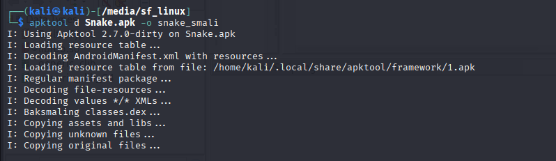
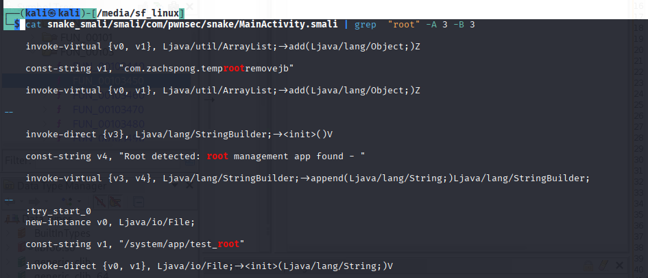
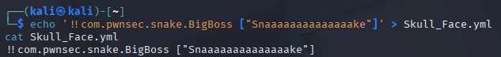
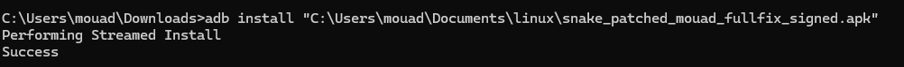
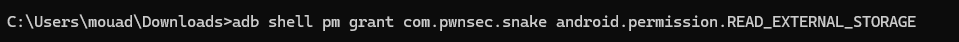
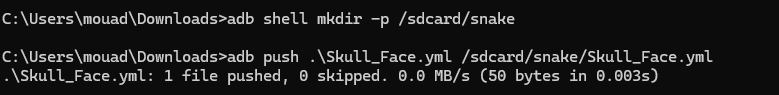

# LabSec19 - Snake.apk

## Auteur

CHARRAJ Mouad

## Objectif

Le but du challenge est de récupérer le flag caché dans l'application Android `Snake.apk`.

L'application vérifie l'environnement au démarrage et se ferme si elle détecte un root, un émulateur ou des traces de Frida. Le flag n'est pas affiché dans l'interface : il est généré par une fonction native et écrit dans `logcat`.

## Auteur

CHARRAJ Mouad

## Analyse

Après décompilation avec `apktool`, le code de l'application est accessible en Smali.

```bash
apktool d Snake.apk -o snake_smali
```



Les protections root sont dans `MainActivity.smali`. Une recherche sur les chaînes liées au root permet de retrouver rapidement les méthodes de détection.

```bash
grep -RniE "root|su|test_root" snake_smali/smali*
```



Les méthodes de détection retournent un booléen. Elles ont été patchées pour retourner `false`.

Exemple de patch Smali :

```smali
.locals 1

const/4 v0, 0x0
return v0
```

Les méthodes patchées sont :

```text
checkForDangerousBinaries
checkForRootManagementApps
checkForRootShell
checkForWritableSystem
isDeviceRooted
```

Une protection native était aussi présente dans `lib/x86/libsnake.so`. Elle utilisait notamment `ptrace`, `pthread_create`, `exit` et `_exit`. Ces appels ont été neutralisés pour permettre à l'application de continuer son exécution sur l'émulateur.

## Auteur

CHARRAJ Mouad

## Payload YAML

Dans `MainActivity`, l'application attend un extra Intent nommé `SNAKE` avec la valeur `BigBoss`. Si cette condition est respectée, elle lit le fichier suivant :

```text
/sdcard/snake/Skull_Face.yml
```

Le fichier YAML permet d'instancier la classe `com.pwnsec.snake.BigBoss` avec le paramètre attendu.

Payload utilisé :

```yaml
!!com.pwnsec.snake.BigBoss ["Snaaaaaaaaaaaaaake"]
```



## Installation et préparation

L'APK patché et signé est installé sur l'émulateur.

```cmd
adb install "C:\Users\mouad\Documents\linux\snake_patched_mouad_fullfix_signed.apk"
```



La permission de lecture du stockage externe est accordée à l'application.

```cmd
adb shell pm grant com.pwnsec.snake android.permission.READ_EXTERNAL_STORAGE
```



Le dossier attendu est créé, puis le payload YAML est envoyé au bon emplacement.

```cmd
adb shell mkdir -p /sdcard/snake
adb push .\Skull_Face.yml /sdcard/snake/Skull_Face.yml
```



## Exploitation

L'application est lancée avec l'extra Intent attendu.

```cmd
adb shell am start -S -n com.pwnsec.snake/.MainActivity -e SNAKE BigBoss
```

Ensuite, le flag est récupéré dans `logcat`.

```cmd
adb logcat -d | findstr /i "BigBoss Skull YML Error AndroidRuntime pwnsec"
```

![Flag dans logcat]


## Flag

```text
PWNSEC{W3'r3_N0t_T00l5_0f_The_g0v3rnm3n7_0R_4ny0n3_3ls3}
```

## Conclusion

Le challenge repose sur deux points principaux : le contournement des protections anti-analyse et l'exploitation d'une désérialisation SnakeYAML. Une fois les protections Java et natives neutralisées, le payload YAML permet d'instancier `BigBoss` avec la bonne chaîne. La méthode native génère ensuite le flag et l'écrit dans les logs Android.

## Auteur

CHARRAJ Mouad
